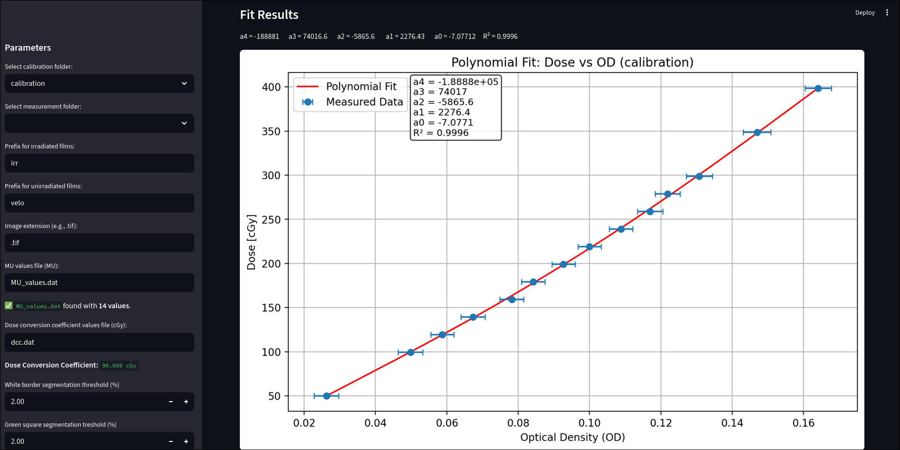

# GAF Film Calibration GUI

**Current Version**: 1.1.0 July 2025

---

## 🧾 Overview

This **Streamlit-based GUI** provides a pipeline for **GAFchromic film dosimetry calibration and measurement** using automatic segmentation, Optical Density estimation and polynomial curve fitting.
This tool is intended for **clinical medical physicists**, **dosimetrists**, **technicians** and **researchers** involved in radiotherapy QA or film dosimetry. 
The algorithms used for segmentation and polynomial fitting routines are fully transparent.

---

## 🧪 Features

- 📈 **Calibration Workflow**:
  - Automatic segmentation of irradiated and unirradiated film scans.
  - Polynomial fit of OD-to-dose relationship with uncertainty propagation.
  - Interactive visualization and calibration comparison.
  - Multiple calibration run saving and overlay plotting.

- 📊 **Measurement Workflow**:
  - Uses saved or uploaded calibrations for dose estimation.
  - Provides OD values and associated errors.
  - Supports results export to CSV and Excel.

- 💾 **Export Options**:
  - Fitted polynomial coefficients `.dat`.
  - Calibration plots as `.png`.
  - Dose tables as `.csv`, `.xlsx`.

---

## 🛠 Requirements

- Recommended Python version ≥ 3.13.5
- It's recommended to use a virtual environment.
- Install the dependencies as written below.

---

## ✅ Make a Virtual Environment (recommended)

- To isolate dependencies and avoid interfering with system-wide packages, it’s recommended to use a custom **Python virtual environment**.

1. Make sure Python is installed. 
2. Go into the folder you want to setup your environment.
3. Then, run:

  ```bash
  python -m venv <your chosen environment name>
  ```

- This will create a folder named `<your chosen environment name>/` containing your isolated environment. This will keep your dependencies well isolated from your main python environment.

- To access the environment (you have to make sure to **do this everytime** you try to run the GAF_GUI app or want to install dependencies) in **Linux/macOS**:

  ```bash
  source <your chosen environment name>/bin/activate
  ```

- NOTE: this last command is different on **Windows**:

  ```powershell
  <your chosen environment name>\Scripts\activate.bat
  ```

---

## ⬇️ Downlaod the script

- Realistically, you only need the main `gaf_gui_streamlit.py` script file, you can download it from the **release** section on the right.
- If you want to have also some example files, like a `MU_values.dat` or `dcc.dat`, feel free to `git clone` this entire repository, so you can also update it automatically by using `git pull`.
  ```
  git clone https://github.com/Pherrara/GAF_GUI.git
  cd GAF_GUI/
  git pull
  ``` 

---

## 📦 Dependencies

- Once in your chosen python environment, install required packages with:
``` shell
pip install streamlit numpy pandas opencv-python matplotlib openpyxl
```

- Or install the dependencies manually:
	- `streamlit`
	- `numpy`
	- `pandas`
	- `opencv-python`
	- `matplotlib`
	- `openpyxl`

---

## ▶️ Usage

1. **Launch the App**. From inside the script folder:
  ```bash
  streamlit run gaf_gui_streamlit.py
  ```

2. **Prepare Folders:**
   - Place numbered `.tif` film scans or similar formats into a folder for **calibration** and/or **measurement**. Those folders need to be in the root folder of the python script.
   - Use filename prefixes like `irr01.tif`, `velo01.tif`, etc. to distinguish irradiated ('irr') and unirradiated ('velo').
   - The number of irradiated and unirradiated films file must be the same.

3. **Required Input Files:**
   - `MU_values.dat`: One line per film with monitor units used during calibration.
   - `dcc.dat`: Single float value (dose in cGy for 100 MU at calibration geometry). e.g. `99.60` for 99.60 cGy for every 100 MUs.

4. **Interactive GUI:**
   - Select folders and parameters via the sidebar.
   - Follow the in-app instructions to calibrate or measure.

---

## 📁 Folder Structure Example

```
project_root/
│
├── gaf_gui_streamlit.py
├── MU_values.dat
├── dcc.dat
├── calibration/
│   ├── irr01.tif
│   ├── velo01.tif
│   └── ...
├── measurement/
│   ├── irr01.tif
│   ├── velo01.tif
│   └── ...
```


---

## 🙏 Acknowledgements

**Author**: Alessandro Michele Ferrara  
**Contact**: alessandromichele.ferrara@gmail.com  
**Contributions and feedback** are welcome.
